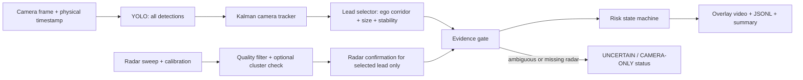
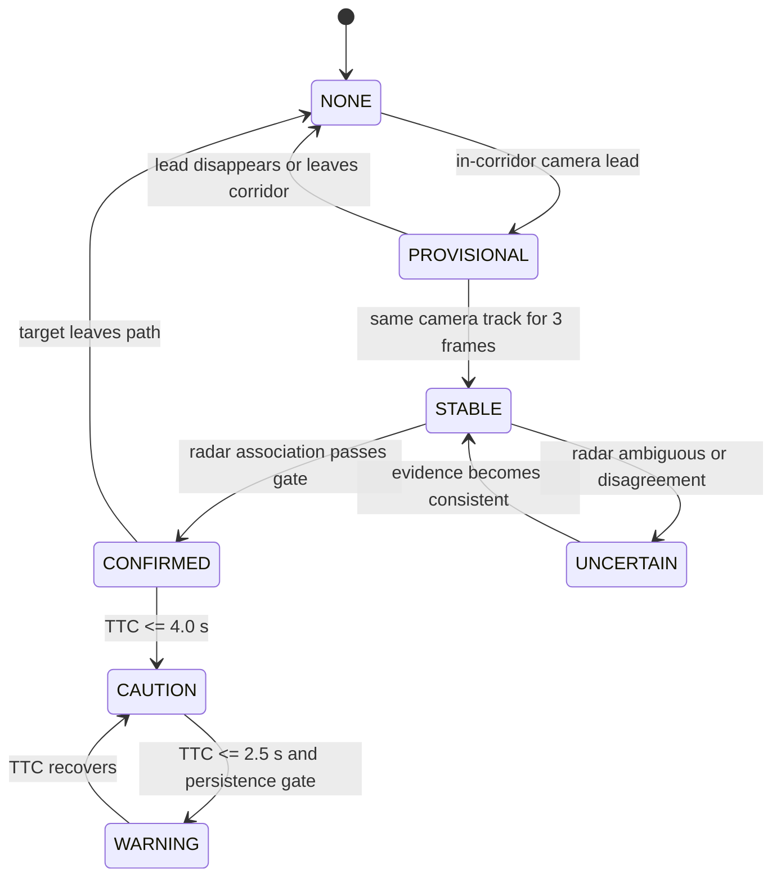

# Guardian Co-Pilot — Stable Hackathon Baseline Redesign

## 1. Decision first

The hackathon baseline is a **single lead-object collision-warning system**. It detects many objects, but only assesses collision risk for the one vehicle most plausibly in the ego vehicle's current path.

It must be conservative and explainable. A missing or ambiguous sensor observation is evidence to reduce confidence, not a reason to guess.

### In scope

- Camera multi-object detection and lightweight tracking.
- One in-path lead-object candidate.
- Radar as optional range/relative-velocity confirmation.
- TTC-based `CAUTION`, `WARNING`, `UNCERTAIN`, and `NONE` outputs.
- Deterministic replay, annotated video, JSONL evidence, and scenario tests.

### Explicitly out of scope

- Full multi-object radar-camera fusion.
- Learned fusion, 3D detector training, BEV network, or a heavier YOLO backbone.
- Autonomous braking/control.
- Claiming collision performance from normal-driving clips without event labels.

## 2. What we learned from the previous experiments

| Finding | Evidence | Baseline decision |
|---|---|---|
| Detection is not the first bottleneck | YOLO detected objects in 38/39 replay frames | Keep the small YOLO model; do not upgrade backbone yet. |
| Temporal identity matters | IoU-only tracker created 70 IDs; lightweight Kalman reduced this to 59 | Use Kalman camera tracking as the default tracker. |
| Sensor time must be physical time | nuScenes frames are about 500 ms apart; 5 FPS was only video playback | Use dataset/capture timestamps for every policy and tracker. |
| A 2D box is not radar identity | Point-in-box often accepted 9–27 radar points | Radar is confirmation only; never force a match. |
| Geometry is useful but not sufficient | Cluster/pose experiments improved rejection, not reliable association everywhere | Keep it as an optional diagnostic, not an MVP dependency. |
| `UNCERTAIN` is a correct output | It blocked unjustified warnings in ambiguous frames | Treat uncertainty as a visible safety state, not an error. |

## 3. The rebuilt baseline

### Ownership of each sensor

| Component | Camera owns | Radar owns | Never infer |
|---|---|---|---|
| Detection | Object class and 2D location | — | Radar point equals a camera object only because of overlap |
| Tracking | Image-space identity and continuity | Range/velocity continuity when clear | A tracker ID is physical ground truth |
| Lead selection | Whether an object appears in ego corridor | Confirmation only | The nearest radar return is the lead vehicle |
| TTC | Candidate identity/path gate | Range and closing speed | Camera box height is accurate physical range |

## 4. State machine

`CAMERA-ONLY` is an overlay/status label for a stable camera lead without trusted radar. It is not a collision warning by itself in this MVP.

## 5. Initial configuration (to tune only after scenario replay)

| Setting | Initial value | Why |
|---|---:|---|
| Camera detector confidence | 0.50 | Preserve small/far lead candidates for tracking. |
| Camera track stability | 3 frames | Blocks one-frame detector noise at nuScenes cadence. |
| Tracker expiry | 1.5 × sensor cadence, minimum 400 ms | Uses physical sensor time rather than video FPS. |
| Radar association gate | 0.65 | Radar below this threshold is unusable for warning. |
| Caution TTC | 4.0 s | Early, visible risk state. |
| Warning TTC | 2.5 s | Conservative warning threshold; requires stable persistence. |
| Hysteresis | retain previous level until recovery | Prevents alert flicker. |

These are **initial engineering settings**, not safety-certified parameters. They must be reported with the evaluated scenario set.

## 6. Acceptance scenarios before the demo

| Scenario | Required expected result | Failure means |
|---|---|---|
| A. Clear single lead on a straight path | Camera ID persists; radar can confirm; risk is stable | Tracking/lead geometry is not ready. |
| B. Brief camera dropout | No one-frame warning spike; recovery is explainable | Hysteresis/tracker needs tuning. |
| C. Dense/ambiguous traffic | `NONE` or `UNCERTAIN`; no forced warning | Association policy is unsafe. |

Each replay produces an annotated MP4, per-frame JSONL, and a short summary row. A collision-positive clip is later required to claim warning lead time; it is not replaced by normal-driving data.

## 7. Code direction

### Keep as default MVP path

- `YoloDetector`
- `KalmanTracker`
- `CameraLeadSelector`
- Existing ego-corridor and risk gates
- `associate_radar_to_lead(mode="point_box")` only as a conservative confirmation input
- Annotated replay runner and evidence outputs

### Keep, but move behind an experimental flag

- Radar clustering and global-frame temporal association
- Multi-object one-to-one camera/radar assignment
- Any learned/deep fusion approach

## 8. Short build order

1. Create/label three short acceptance replays: A, B, and C.
2. Make the default runner emit the state-machine status and all camera tracks in its overlay.
3. Tune only the six settings in section 5 against the three replays.
4. Freeze pipeline and outputs when all three cases pass repeatedly.
5. Build the hackathon presentation around the visible evidence and known limits.

## 9. Definition of a stable baseline

A baseline is ready for the hackathon when it can replay the same clips deterministically, explain every state transition in video/logs, avoid forced associations in ambiguity, and preserve a clear lead target through normal short-term detector noise. It does not need to solve all dense-traffic scenes.
