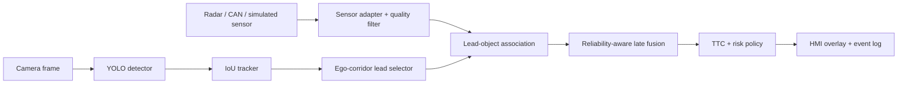

# Guardian Co-Pilot — Hackathon MVP Master Plan

## 1. Project statement

Build a **warning-only forward collision estimation demo** for a single forward camera and front radar/sensor stream.

The MVP must answer one operational question, per frame:

> Is a stable lead object inside the ego corridor closing with low enough `TTC` to show a caution or warning?

The system is a perception and HMI prototype. It does **not** control braking, steering, or a real vehicle.

## 2. Product goal

At the final demo, a reviewer can play a recorded scenario and see:

```text
video + selected object + radar-match state + fused range/velocity + TTC + confidence + risk
```

The important product claim is not “perfect detection.” It is:

> The system only trusts radar-derived TTC when the camera-radar association is stable and reliable; otherwise it visibly falls back to an uncertain/camera-only state.

## 3. Scope

### Must ship

- Forward-camera vehicle/person detection using a small YOLO model.
- Persistent camera tracking and an ego-corridor gate.
- Front-radar/sensor adapter that normalizes range, relative velocity, quality, and timestamp.
- Lead-object association with an explicit confidence score.
- Reliability-aware late fusion and `TTC` risk policy.
- `none / caution / warning / uncertain` UI state.
- Annotated replay video, JSONL event log, and summary CSV.
- Offline reproducible demo plus measured p50/p95 latency.

### Explicitly out of scope

- Automatic emergency braking, steering, CAN command output, or safety certification.
- Full-surround perception, map localization, lane planning, or V2X.
- Full multi-object BEV Transformer / end-to-end training.
- Physical sensor calibration from scratch during the event.
- A claim of real-world safety performance.

## 4. MVP architecture



### Key design decisions

| Decision | Reason |
|---|---|
| Lead object only | Keeps association, latency, and demo complexity bounded. |
| Late/object-level fusion | Sensor measurements remain explainable and easy to log. |
| `uncertain` risk state | Never force a radar match just to produce a result. |
| Warning-only | Appropriate for a hackathon prototype; no unsafe actuation. |
| Small YOLO backbone | Detection latency remains the primary compute cost. |
| Recorded replay | Repeatable demonstrations and easy failure investigation. |

## 5. Runtime data contract

Every synchronized frame must become one `LeadObjectInput` record:

```text
frame_id, timestamp_ms
camera lead track:
  track_id, bbox, class, detector_confidence, tracker_confidence,
  in_ego_corridor, camera_range_proxy, image_quality
radar candidate:
  timestamp_ms, range_m, closing_speed_mps, signal_quality,
  association_confidence
outputs:
  fused_range_m, fused_ttc_s, reliability, radar_used, risk, reason
```

Rules:

- All distance values use metres; velocity uses m/s; timestamps use milliseconds.
- A radar record can be absent; absence is valid and triggers camera/uncertain fallback.
- Radar association confidence must pass a configurable gate before it affects TTC.
- Input and output records are append-only JSONL for replay/debugging.

## 6. Risk policy

| Condition | System response |
|---|---|
| Object outside ego corridor | Ignore for collision warning. |
| Lead track younger than 3 frames | No warning yet. |
| Radar match absent/ambiguous | `uncertain`; do not issue physical-TTC warning. |
| Sensors disagree strongly | Reduce reliability; remain `uncertain`. |
| Reliable fused TTC <= 4 s | `caution`. |
| Reliable fused TTC <= 2.5 s | `warning`. |

Thresholds are config values, not safety-certified constants.

## 7. Milestones — five-day plan

### Day 1 — Data and visible baseline

- Confirm selected replay clips or sensor source.
- Run YOLO and tracker on one forward clip.
- Render camera box, track ID, ego corridor, and camera-only risk.
- Deliverable: an annotated camera-only MP4.

### Day 2 — Sensor contract and visualization

- Implement one adapter for radar/nuScenes/simulated sensor data.
- Verify timestamp alignment and calibration overlay.
- Log `range`, `velocity`, sensor quality, and association candidate state.
- Deliverable: camera + radar/BEV diagnostic replay.

### Day 3 — Lead-object association and fusion

- Select one stable in-corridor lead object.
- Add association confidence and radar fallback.
- Integrate the existing reliability-aware fuser.
- Deliverable: fused range/TTC/reliability in video and JSONL.

### Day 4 — Warning policy and hard cases

- Add hysteresis, warning persistence, and `uncertain` HMI state.
- Test positive closing, adjacent-lane, ambiguous-radar, and no-radar cases.
- Produce summary CSV and failure tags.
- Deliverable: repeatable scenario report.

### Day 5 — Performance and presentation

- Measure p50/p95 detector and end-to-end latency.
- Freeze configuration and record final demo video.
- Prepare a three-minute pitch and one-page architecture diagram.
- Deliverable: submission package.

## 8. 48-hour cut-down plan

If the event is only two days:

1. Use recorded video and simulated/recorded radar measurements; do not integrate a live radar device.
2. Build one positive lead-vehicle case and one ambiguous fallback case.
3. Keep single lead-object association only.
4. Deliver video, JSONL, latency table, and pitch; defer multi-scene evaluation.

## 9. Acceptance criteria

### Functional

- The demo runs from one command on the target laptop/PC.
- A selected lead object remains stable before any warning is emitted.
- The system visibly displays `radar used` versus `uncertain fallback`.
- Adjacent-lane targets do not trigger a lead-object warning.
- Every decision is written to JSONL with a human-readable reason.

### Performance

- Sensor adapter + association + fusion should remain below 10 ms per frame on CPU.
- Report detector latency separately; do not hide it inside end-to-end average.
- Demo target: 5 FPS laptop replay or >=10 FPS on target GPU hardware.

### Demo quality

- One reliable approaching lead-object sequence causes `caution` then `warning`.
- One low-confidence sensor match produces `uncertain`, not a forced warning.
- One report explains a failure or limitation honestly.

## 10. Risk register and fallback

| Risk | Mitigation | Fallback |
|---|---|---|
| No live radar available | Use nuScenes/replayed radar contract | Synthetic sensor replay with explicit label |
| YOLO too slow on laptop | Use YOLO11n, smaller input, 5 FPS replay | Precompute detections for demo video |
| Association unreliable | Raise gate and expose `uncertain` | Camera-only visual warning demo |
| Calibration unavailable | Use supplied dataset calibration | Do not claim live sensor fusion |
| Dataset incomplete | Keep two curated clips locally | Use deterministic synthetic replay |
| Scope creep | Maintain lead-object-only rule | Defer multi-object work to post-hackathon |

## 11. Submission package

```text
hackathon_mvp/
  MASTER_PLAN.md
  README.md
  lead_object_system.py
  run_demo.py
  config/                 # frozen thresholds / device profile
  outputs/
    demo.mp4
    decisions.jsonl
    summary.csv
    latency.json
  pitch/
    architecture.png
    demo_script.md
```

## 12. Pitch structure — three minutes

1. **Problem:** camera-only collision estimation has weak metric range/velocity; radar is sparse and ambiguous.
2. **Method:** lead-object late fusion with explicit association confidence and safe fallback.
3. **Demo:** reliable radar match → TTC warning; ambiguous match → uncertain state.
4. **Evidence:** replay metrics, latency breakdown, and failure visualization.
5. **Next step:** temporal/multi-object association after the hackathon.

## 13. Definition of done

The MVP is done when a fresh user can run the replay, understand why each warning occurred or was suppressed, and see an honest latency/failure report without relying on undocumented manual steps.
