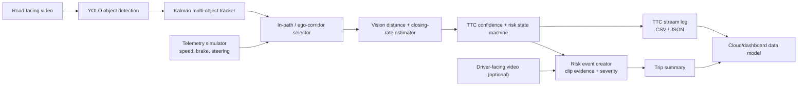

# Official Scope — Vision-based Collision Risk Monitor

## Product decision

The competition MVP is **vision-only**. Radar, radar-camera association, and sensor fusion are not part of the default product path.

The system consumes road-facing video plus a telemetry simulator and produces explainable TTC risk evidence for a remote Fleet Manager dashboard.

```text
Road-facing video + telemetry simulator
  -> detect and track road objects
  -> determine in-path candidate
  -> estimate distance / closing motion / TTC from vision
  -> confidence and risk state
  -> TTC stream + event clips + trip summary + dashboard data
```

Radar experiments remain in the repository only as future research/diagnostic work. They must not be required to run the hackathon MVP.

## Required inputs

| Input | MVP use |
|---|---|
| Road-facing video | Detect vehicle, pedestrian, bicycle, and obstacle candidates; track them through time. |
| Telemetry simulator | Ego speed, brake state, steering angle, timestamp, vehicle/trip ID. |
| Driver-facing video | Optional auxiliary evidence: identify a delayed/no brake response after a danger event. |

## Vision-only TTC logic

For each tracked object in the estimated ego path:

1. Estimate a camera distance proxy `D` using calibrated ground-plane geometry when available; otherwise use class-aware bounding-box scale as a clearly labelled fallback.
2. Smooth distance/proxy over time using the camera tracker/Kalman state.
3. Estimate closing rate from temporal change, `v_rel = -dD/dt`.
4. Estimate `TTC = D / v_rel` only when the target is approaching and the track is stable.
5. Use ego speed, brake state, and steering as context gates:
   - ego speed validates whether a collision risk is plausible;
   - braking reduces escalation or records reaction context;
   - steering widens/shifts the visual ego corridor during turns.

Telemetry does **not** identify an external object and does not replace vision tracking.

## Risk confidence

Confidence is a visible value, not an implicit model claim. It combines:

- detector confidence;
- tracker age/continuity;
- ego-corridor membership;
- distance-proxy quality;
- temporal stability of estimated TTC;
- telemetry validity and timestamp alignment.

If the object, distance, or TTC is unstable, emit `UNCERTAIN` or do not create an event. Do not invent TTC from one bounding box.

## Risk state policy

| State | Initial condition |
|---|---|
| `NONE` | No stable in-path approaching target, or TTC is safe. |
| `CAUTION` | Stable in-path target with TTC <= 4.0 s. |
| `DANGER` | Stable in-path target with TTC <= 2.5 s for the persistence window. |
| `UNCERTAIN` | Candidate exists but distance/TTC/telemetry evidence is not stable enough. |

`DANGER` creates a collision-risk event; it does not mean an actual collision occurred.

## MVP architecture



## Required outputs and contracts

### 1. TTC Stream Log

One record per processed frame and selected risk candidate:

```json
{
  "timestamp_ms": 12340,
  "vehicle_id": "demo-vehicle-01",
  "trip_id": "trip-001",
  "track_id": "track-0042",
  "object_type": "car",
  "ttc_s": 2.3,
  "confidence": 0.78,
  "risk_level": "danger",
  "ego_speed_mps": 12.4,
  "brake_active": false,
  "steering_angle_deg": 1.2
}
```

Export the exact same schema as JSONL and CSV.

### 2. Collision Risk Event List

Create one event after the `DANGER` persistence gate. Store event ID, start/end timestamps, minimum TTC, severity, selected object type, confidence, reaction context, and annotated clip path.

### 3. Per-trip summary

Store event count, shortest TTC, count by object type, count by severity, duration, and any brake-reaction observations.

### 4. Fleet dashboard data

The MVP dashboard can first read local/cloud JSON records. Required aggregations: events per vehicle/driver/trip, severity, object type, and route coordinate/segment when supplied by the simulator. A route heatmap requires location input; it cannot be derived from video alone.

### 5. Annotated evidence

Render object box, track ID, TTC, confidence, ego speed, brake state, risk state, and event ID when active. Export a full annotated trip video and trimmed event clips.

## What we reuse from current work

- YOLO adapter and all-object detection.
- Kalman tracker.
- Ego-corridor geometry and annotated video renderer.
- JSONL logging/replay infrastructure.
- Stability, persistence, and uncertainty gates.

## What we stop using in the MVP

- Radar input and radar association.
- Radar-primary TTC.
- Radar clustering, global-frame radar tracking, and radar fusion thresholds.

## Build order

1. Define telemetry simulator CSV/JSON contract and a deterministic replay reader.
2. Rebuild TTC estimator around vision distance/proxy plus temporal closing rate.
3. Emit the TTC stream log and risk event list from one road-facing clip.
4. Add annotated event clips and per-trip summary.
5. Add a minimal remote/dashboard data API or hosted JSON store.
6. Add driver-facing brake-reaction evidence only after the road-facing core works.

## Definition of done for the first baseline

- Runs from one video and one telemetry file without radar.
- Writes CSV and JSONL TTC logs.
- Produces zero or more evidence-backed danger events and clips.
- Produces an annotated video and per-trip summary.
- Never emits `DANGER` before track/TTC persistence requirements are met.
