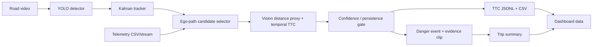

# Vision-only Baseline Architecture

## Inputs

- Road-facing video: vehicle, pedestrian, bicycle, and obstacle candidates.
- Telemetry simulator: timestamp, vehicle/trip ID, ego speed, brake state, steering angle; optional route coordinates for the dashboard heatmap.
- Driver-facing video: optional reaction evidence after a danger event.

## Baseline

## Sensor responsibilities

| Source | Responsibility |
|---|---|
| Camera | Object class/location, temporal track, in-path candidate, vision distance proxy, closing motion. |
| Telemetry | Ego-motion context, brake/steering state, trip/vehicle identity, route metadata. |
| Driver-facing video | Optional brake-reaction evidence only. |

## Initial risk policy

- Require three observations of the same in-path camera track.
- Estimate TTC only when vision distance/proxy is stable and decreasing.
- `CAUTION`: TTC <= 4.0 s.
- `DANGER`: TTC <= 2.5 s for the warning-persistence window.
- `UNCERTAIN`: candidate exists but track, distance, or TTC is unstable.
- A `DANGER` event must reference its clip, frame range, object type, TTC minimum, and confidence.

## Important limitation

Monocular distance is an estimate. Confidence must fall when calibration, object-size assumption, visual track, or TTC derivative is unreliable. The first MVP prioritizes explainable evidence and conservative events over claiming metric-grade depth.
